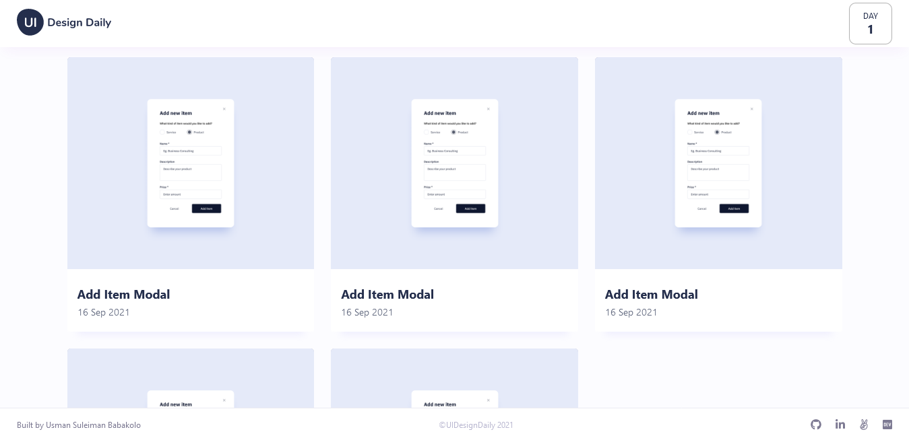

# UI Design Daily Gallery



## Built With

- React
- CSS/SASS

## Live Demo

[Live Demo Link](https://ui-design-daily.netlify.app//)

## Getting Started

To get a local copy up and running follow these simple example steps.

### Prerequisites

- NodeJS - [v16.x](https://nodejs.org/en/)
- [Yarn](https://yarnpkg.com/)

### Setup

```bash
git clone https://github.com/usmansbk/trello.git
cd ./trello
```

### Install

```bash
yarn
```

### Usage

```bash
yarn start
```

### Build

```bash
yarn build
```

### Run tests

```bash
yarn test
```

## Authors

👤 **Babakolo Usman Suleiman**

- GitHub: [@usmansbk](https://github.com/usmansbk)
- LinkedIn: [LinkedIn](https://www.linkedin.com/in/usmansbk/)

## 🤝 Contributing

Contributions, issues, and feature requests are welcome!

Feel free to check the [issues page](../../issues/).

## Show your support

Give a ⭐️ if you like this project!

## Acknowledgments

- [UI Design Daily](https://www.uidesigndaily.com/)
